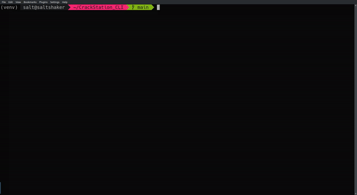

# Talon c2

This project is command and control server
## Getting Started

### Instalation
```
pip install -r requirements.txt
```
### Executing Program
```python3 Talon.py```
## Original Prject: 
https://github.com/f0cker/crackq

# Talon
